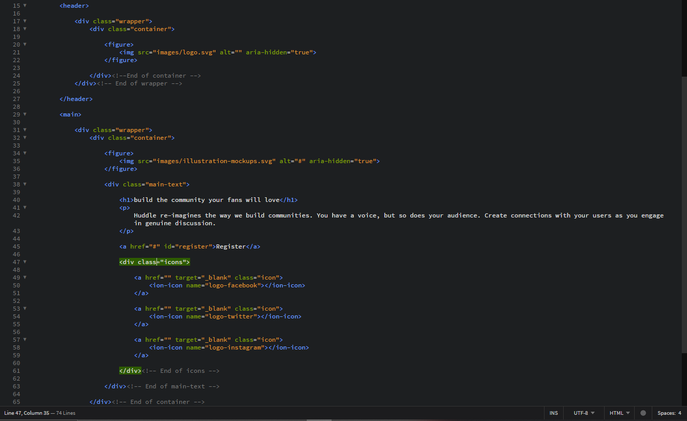
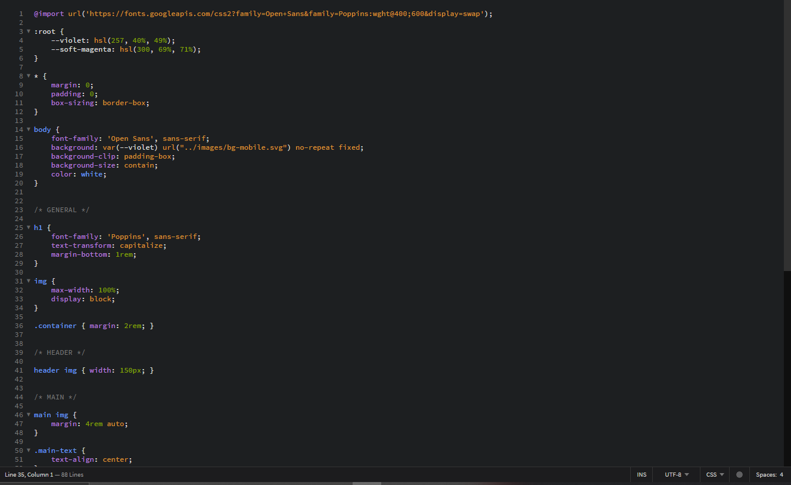
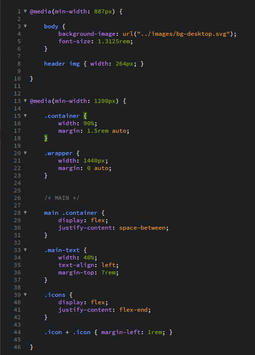

# Frontend Mentor - Huddle landing page with single introductory section solution

This is a solution to the [Huddle landing page with single introductory section challenge on Frontend Mentor](https://www.frontendmentor.io/challenges/huddle-landing-page-with-a-single-introductory-section-B_2Wvxgi0). Frontend Mentor challenges help you improve your coding skills by building realistic projects. 

## Table of contents

- [Overview](#overview)
  - [The challenge](#the-challenge)
  - [Screenshot](#screenshot)
  - [Links](#links)
- [My process](#my-process)
  - [Built with](#built-with)
  - [Continued development](#continued-development)
- [Author](#author)

## Overview

### The challenge

Users should be able to:

- View the optimal layout for the page depending on their device's screen size
- See hover states for all interactive elements on the page

### Screenshot

## Links

- Solution URL: [https://www.frontendmentor.io/solutions/responsive-huddle-single-lading-page-using-css-flexbox-eGc6w2pb_z](https://www.frontendmentor.io/solutions/responsive-huddle-single-lading-page-using-css-flexbox-eGc6w2pb_z)

- Live Site URL: [https://tzienom-huddle-single-page.netlify.app/](https://tzienom-huddle-single-page.netlify.app/)

# My Process

### Built with

- HTML5 Semantic markup
- Flexbox
- Mobile-first workflow

### Continued development

- Responsive Layout
- FlexBox

# Author

- Frontend Mentor - [@Tzienom](https://www.frontendmentor.io/profile/Tzienom)